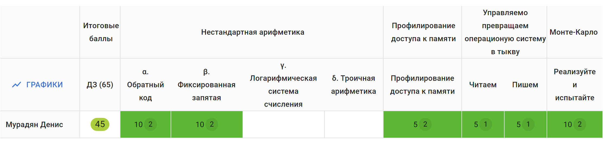

# Algorithms_and_data_structures_

This repository contains the laboratory work completed as part of the "Algorithms and Data Structures" course. Below is a brief description of each project:

---

## **Arithmetic_algorithms**  
### **Integer Arithmetic in One's Complement**  
Implementation of integer arithmetic using one's complement representation:  
```cpp
template<typename BASE> class ones_compl_int {
    ...
};
```
- **Template Parameter:**  
  The `BASE` type determines the underlying type for arithmetic operations (e.g., `int32_t`, `uint64_t`, etc.).

### **Fixed-Point Arithmetic**  
Implementation of arithmetic with fixed-point representation:  
```cpp
template<typename B=int32_t, unsigned FRAC=16> class fixed_point {
    ...
};
```
- **Template Parameters:**  
  - `B` — base type for the arithmetic (e.g., `int32_t`).
  - `FRAC` — the number of bits reserved for the fractional part.

---

## **Memory_profiling**  
### **Matrix Traversal and Performance Analysis**  
- A 1000x1000 matrix is created and iterated row-wise and column-wise, summing up its values.  
- Execution time is measured by placing time markers before and after each traversal method.  
- Results of the profiling are stored in the `results` folder. This includes:
  - Outputs from `valgrind` profiling.
  - Cache-related statistics collected during execution.  
- Valgrind reports provide insights into memory caching and other characteristics of the matrix traversal performance.

---

## **Monte_Carlo_Method**  
### **Estimating Pi Using the Monte Carlo Method**  
- A square with side length 2, centered at the origin, is inscribed with a circle of radius 1.  
- The area of the circle (π) is estimated by generating `TOTAL_POINTS` random points within the square and counting how many fall inside the circle.  

#### **Parallel Computation:**  
- Multiple threads are initialized to handle the computations:  
  - Each thread generates its own set of random points and calculates the count of points inside the circle.  
  - Results are aggregated into a shared variable `pointsInsideCircle`.  

#### **Thread Synchronization:**  
- A mutex (`pointsMutex`) is used to synchronize access to the shared variable, ensuring thread-safe updates and accurate results.

---

## **Reading_Writing_Pumpkin**  
### **Memory Allocation and Testing**  
- Dynamic memory allocation is performed using `malloc` in each function.  
- The amount of allocated memory is controlled via a global variable `memsize`.  
- Tests were successfully conducted with `memsize=32` on a system with 16 GB of RAM.  
- The project ensures robust memory allocation, providing ample space for the "pumpkin."

---

Each project includes the source code, detailed explanations, and, where applicable, test results or performance metrics.

# Results of the Course

Below is a visualization of the results achieved during the course:


